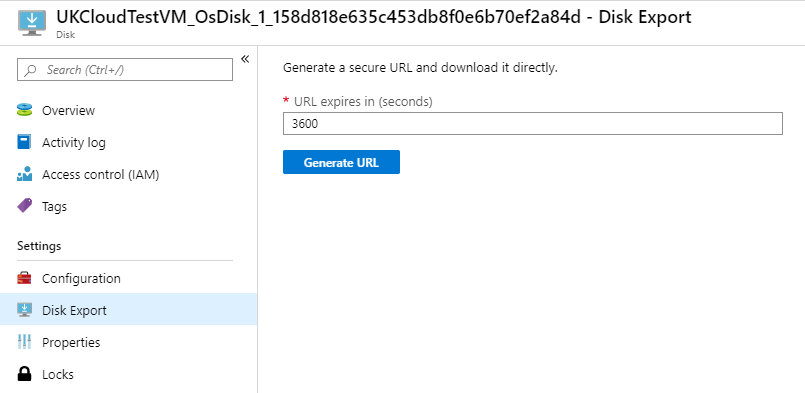
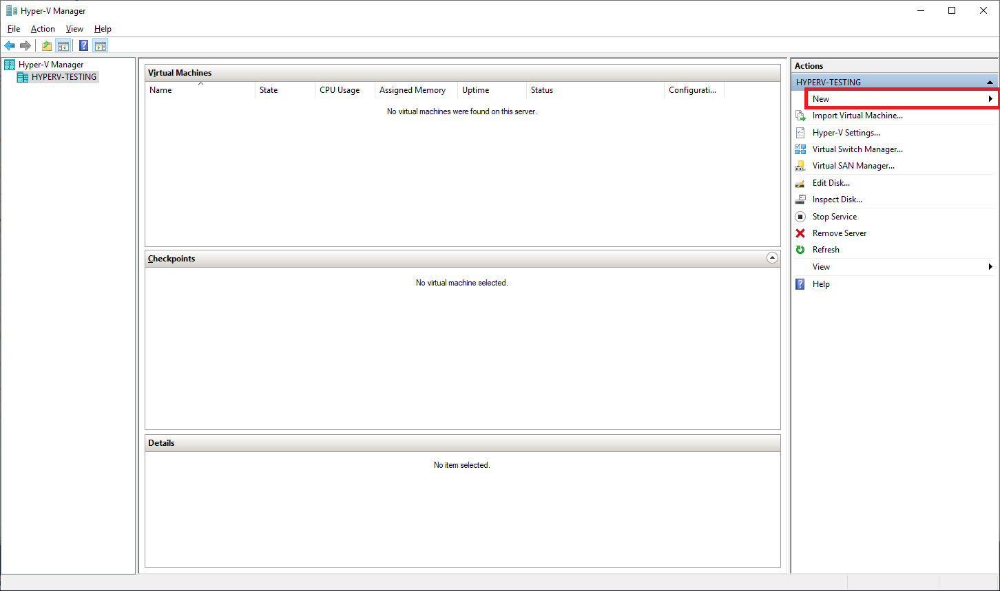
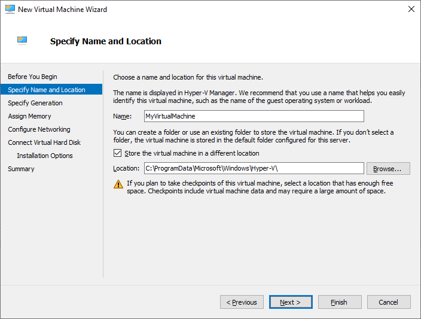
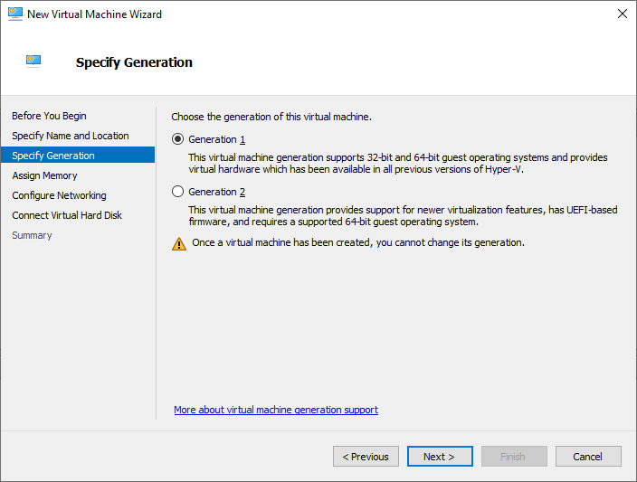
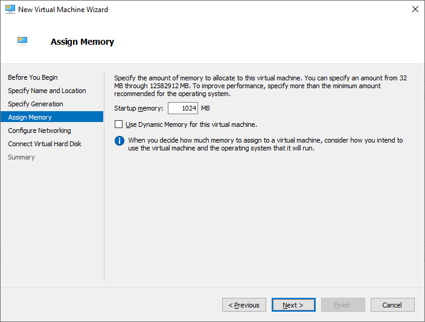
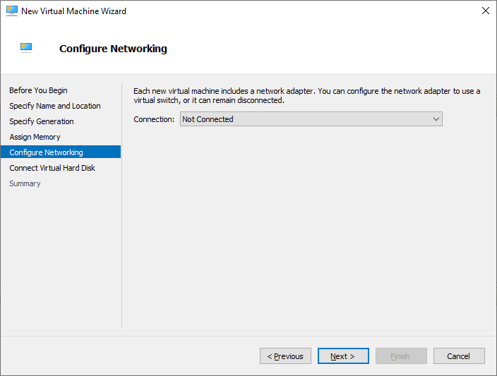
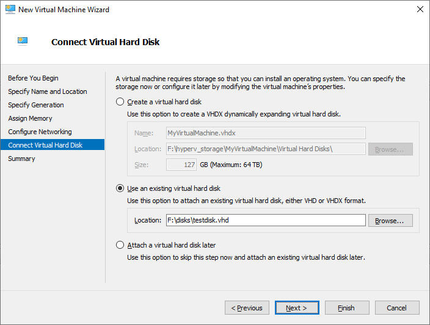
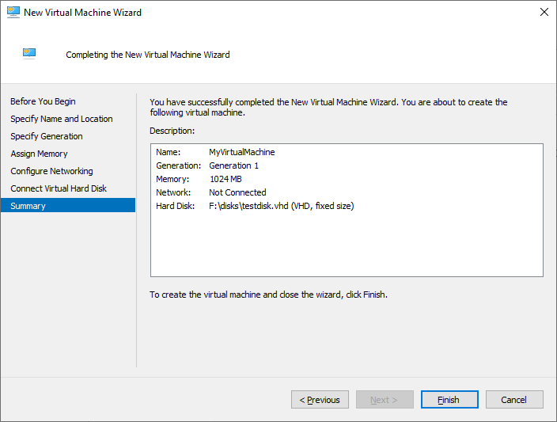

# How to export a disk and use it to create a VM in Hyper-V using the UKCloud Azure Stack Hub portal

## Overview

The following article shows you how to export a disk in the UKCloud Azure Stack Hub portal and use it to create a virtual machine in Hyper-V manager.

## Intended audience

To complete the steps in this article, you must have appropriate access to a subscription in the Azure Stack Hub portal.

## Exporting a disk from an existing virtual machine using the Azure Stack Hub portal

1. Log in to the Azure Stack Hub portal.

    For more detailed instructions, see the [*Getting Started Guide for UKCloud for Microsoft Azure*](azs-gs.md).

2. In the *favourites* panel, select **Virtual machines**.

    

3. In the *Virtual machines* blade, select the VM that you want to add the disk to.

    

4. Under *Settings*, select **Disks**.

    

5. In the *Disks* blade, select the disk that you would like to export.

    

6. In the selected disks' blade, under settings, select **Disk Export**.

    

    > [!IMPORTANT]
    > A disk cannot be exported if it is attached to a running VM. You will need to stop the VM first to be able to export the disk.

7. The default expiration time of the URL is *3600* seconds. Increase this to *36000* for Windows OS disks, otherwise leave as default, then select **Generate URL**.

    > [!NOTE]
    > The default expiration time should be sufficient for downloading small VHD files, such as those of Linux OS or Data disks, but will need to be increased when downloading larger files or if you're downloading over a slow connection.

8. Once generated, the URL will be displayed in the current blade.

    

    > [!IMPORTANT]
    > Ensure that you copy the URL elsewhere, as it will not be displayed again once you navigate away from the Disk Export blade.

9. Enter the URL in a browser to trigger the download of the VHD file.

## Creating a virtual machine in Hyper-V using the downloaded VHD file

1. Open Hyper-V Manager and connect to your server.

2. In the *Actions* pane on the right, select **New** and then **Virtual machine...**

    

3. Enter a name for the virtual machine and choose a location to store it in, then click **Next**.

    

4. Ensure **Generation 1** is selected, then click **Next**.

    > [!IMPORTANT]
    > Generation 2 virtual machines only support VHDX format virtual hard drives.

    

5. For memory, you should try to use at least the same amount that was assigned to the virtual machine in Azure Stack Hub. Click **Next** when you're done.

    > [!TIP]
    > Ideally, you should try to allocate the same amount of memory that was allocated to the virtual machine in Azure Stack Hub.

    

6. If applicable, select a network adapter from the **Connection** dropdown, then click **Next**.

    

7. Select the **Use an existing virtual hard disk** option, and specify the location of the VHD files that was downloaded earlier, then click **Next**.

    

8. Review the details for the virtual machine, then click **Finish**.

    

## Feedback

If you find a problem with this article, click **Improve this Doc** to make the change yourself or raise an [issue](https://github.com/UKCloud/documentation/issues) in GitHub. If you have an idea for how we could improve any of our services, send an email to <feedback@ukcloud.com>.
